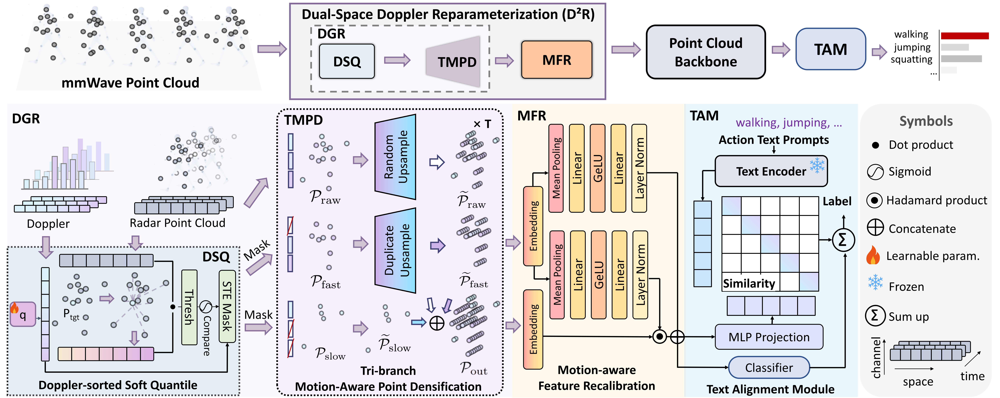

<h1 align="center">DAP: Doppler-aware Point Network for Heterogeneous mmWave Action Recognition</h1>

<p align="center">
  <a href="https://scholar.google.com.hk/citations?user=kU4rtNQAAAAJ&hl=zh-CN">Jiaying Lin<sup>1</sup></a>,
  <a href="https://openreview.net/profile?id=~Shiman_Wu1">Shiman Wu<sup>2</sup></a>,
  <a href="https://scholar.google.com.hk/citations?hl=zh-CN&user=jdOJpl0AAAAJ">Jinfu Liu<sup>3</sup></a>,
  <a href="https://scholar.google.com/citations?user=sEeImYgAAAAJ&hl=en">Can Wang<sup>4</sup></a>,
  <a href="https://scholar.google.com.hk/citations?user=woX_4AcAAAAJ&hl=zh-CN">Mengyuan Liu<sup>1</sup></a>
</p>

<p align="center">
  <sup>1</sup>Peking University&nbsp;&nbsp;&nbsp;
  <sup>2</sup>Huazhong University of Science and Technology&nbsp;&nbsp;&nbsp;
  <sup>3</sup>DJI Technology Co., Ltd.&nbsp;&nbsp;&nbsp;
  <sup>4</sup>Kiel University
</p>

<p align="center">
  <a href="https://arxiv.org/abs/2605.09604">📄 Paper</a> |
  <a href="https://github.com/jolin830/DAP-Net">💻 Code</a>
</p>

---

## ✨ Introduction

Millimeter-wave (mmWave) radar provides privacy-preserving sensing and is highly suitable for human action recognition (HAR). However, existing mmWave point cloud datasets are still limited in scale and are mostly collected under homogeneous single-source settings, which makes them less capable of handling real-world distribution shifts caused by heterogeneous radar sources, such as different devices and frequency bands.

To address this issue, we introduce **UniMM-HAR**, the largest and first mmWave point cloud HAR dataset for heterogeneous multi-source scenarios. UniMM-HAR standardizes three distinct radar configurations and provides unified protocols for evaluating cross-source generalization.

We further propose **DAP-Net** (Doppler-aware Point Network), a heterogeneous mmWave action recognition framework that enhances intra-modal representations and performs cross-modal alignment to learn source-invariant action semantics. By leveraging action-consistent spatio-temporal Doppler patterns as anchors, the **Dual-space Doppler Reparameterization (D<sup>2</sup>R)** module performs sample-adaptive geometric densification and Doppler-guided feature recalibration, while the **Text Alignment Module (TAM)** provides stable semantic anchors in a pretrained textual space.

Extensive experiments show that DAP-Net significantly outperforms existing methods under heterogeneous radar settings, achieving state-of-the-art accuracy and strong cross-source robustness.

---

## 🧩 Framework

<p align="center">
  
</p>

---

## 📦 Dataset

<p align="center">
  
</p>

### Dataset Access

The processed UniMM-HAR dataset is currently available upon request for academic research only.
Researchers interested in obtaining the dataset should contact:
**jylin25@stu.pku.edu.cn**.
Please include your full name, institution or organization, country, research purpose, and supervisor information for students or postdoctoral researchers in the email.

---

### 📊 Dataset Visualization

<p align="center">
  
</p>

---

### 🔧 Data Preparation

1. Download the original datasets:
   - [RadHAR](https://github.com/nesl/RadHAR)
   - [mRI](https://github.com/SizheAn/mRI)
   - [MM-Fi](https://github.com/ybhbingo/MMFi_dataset)

2. Generate CSV files:
```bash
python dataset/makecsv/RadHAR2csv.py
python dataset/makecsv/mRI2csv.py
python dataset/makecsv/MMFI2csv.py
````

3. Generate NPZ files:

```bash
python dataset/makenpz/makenpz.py
```

4. If normalization is needed:

```bash
python dataset/makenpz/makenpz_normal.py
```

5. Split the dataset according to the rules described in the paper.

---

### 🏷 Naming Convention

Example:
`D001A001E001P001S0001`

* `D`: dataset identifier
* `A`: action category
* `E`: acquisition environment
* `P`: participant index
* `S`: sample index

If the original dataset does not provide certain fields, the corresponding part can be omitted.

---

### 🗂 Dataset Directory Structure

```text
UniMM-HAR/
├── CSub/
│   ├── train/
│   │   ├── D000A003P000S0001.npz
│   │   └── ...
│   └── test/
│       ├── D000A003P010S0084.npz
│       └── ...
├── CSet/
│   ├── train/
│   │   ├── D000A002P000S0001.npz
│   │   └── ...
│   └── test/
│       ├── D001A001E000P000S0001.npz
│       └── ...
└── All/
    ├── MMFI/
    │   ├── D001A001E000P000S0001.npz
    │   └── ...
    ├── RadHAR/
    │   ├── D002A000S0001.npz
    │   └── ...
    └── mRI/
        ├── D000A000P000S0001.npz
        └── ...
```

---

### 📚 Action Classes

| ID | Action                    |
| -: | ------------------------- |
|  0 | walk                      |
|  1 | jump                      |
|  2 | squat                     |
|  3 | stretch                   |
|  4 | jumping jack              |
|  5 | box                       |
|  6 | extend left upper limb    |
|  7 | extend right upper limb   |
|  8 | extend both upper limbs   |
|  9 | left front lunge          |
| 10 | right front lunge         |
| 11 | left side lunge           |
| 12 | right side lunge          |
| 13 | extend left limb          |
| 14 | extend right limb         |
| 15 | expand chest horizontally |
| 16 | expand chest vertically   |
| 17 | twist left                |
| 18 | twist right               |
| 19 | mark time                 |
| 20 | extend both limbs         |
| 21 | raise left hand           |
| 22 | raise right hand          |
| 23 | wave left hand            |
| 24 | wave right hand           |
| 25 | pick up object            |
| 26 | throw left                |
| 27 | throw right               |
| 28 | kick left                 |
| 29 | kick right                |
| 30 | extend left body          |
| 31 | extend right body         |
| 32 | bow                       |

---

## ⚙️ Installation

```bash
conda create -n dap python=3.9
conda activate dap
pip install -r requirements.txt
```

---

## 📁 Directory Structure

```text
DAP-Net/
├── dataset/           # Dataset preprocessing
├── models/            # Network architectures
├── utils/             # Utilities
├── checkpoints/       # Saved checkpoints
├── figs/              # Figures for README
├── main.py            # Training / evaluation entry
└── ours_sk_normal.py  # Dataset loader
```

---

## 🚀 How to Run

```bash
python main.py
```

---

## 🔮 Ongoing Development

UniMM-HAR is an ongoing project.  
We are continuously collecting and organizing more diverse mmWave point cloud data under additional devices, environments, subjects, and action categories to further support research on heterogeneous cross-source generalization and real-world deployment.

---

## 🙏 Acknowledgement

This project builds upon several publicly available mmWave human activity recognition datasets. We sincerely thank the authors and contributors of the following datasets and open-source resources:

* [RadHAR](https://github.com/nesl/RadHAR)
* [mRI](https://github.com/SizheAn/mRI)
* [MM-Fi](https://github.com/ybhbingo/MMFi_dataset)

We gratefully acknowledge their efforts in collecting, maintaining, and publicly releasing these datasets, which made this research possible.


